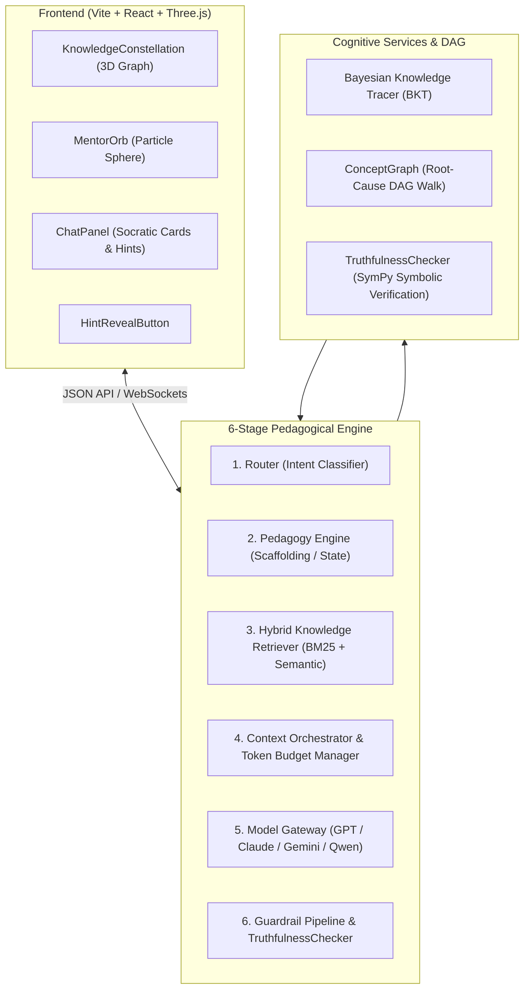

# 🌌 Aether AI Tutor: Pedagogical Engine & 3D Cognitive Constellation

> An intelligent, multi-provider AI tutoring platform featuring **Bayesian Knowledge Tracing (BKT)**, **deterministic Concept Graph root-cause diagnosis**, **symbolic mathematical truthfulness guardrails**, and an interactive **Three.js 3D cognitive learning environment**.

[](https://github.com/PraneetNS/AI_Tutor/actions)
[](https://www.python.org/)
[](https://reactjs.org/)
[](https://threejs.org/)
[](https://opensource.org/licenses/MIT)

---

## 🏛️ System Architecture



---

## 🌟 Key Capabilities

### 1. Bayesian Knowledge Tracing (BKT)
- Closed-form mathematical posterior updates tracking mastery $P(L)$ across 4 parameters:
  - $P(L_0)$: Initial prior mastery
  - $P(T)$: Learning transition probability
  - $P(G)$: Guess probability
  - $P(S)$: Slip probability
- Pure arithmetic computation with zero non-deterministic LLM hallucinations.

### 2. Deterministic Concept Graph & Root-Cause Diagnosis
- Topological curriculum DAG (`concepts` & `concept_prerequisites`).
- Pre-computes `curriculum_position` (`mastered`, `in_progress`, `locked`, `next_ready`).
- Performs backward ancestry DAG walk to diagnose the exact foundational bottleneck (e.g. diagnosing missing `chain_rule` when a student struggles with `backpropagation`).

### 3. TruthfulnessChecker Output Guardrail Stage
- Symbolic mathematical check using **SymPy** for algebraic equations, derivatives ($\frac{d}{dx}$), and integrals ($\int$).
- RAG ground-truth cross-referencing for factual claims.
- **Anti-Hallucination Rejection**: Detects if a draft model response praises or validates an incorrect student step, immediately rejecting the response and forcing explicit regeneration naming the exact error.

### 4. Multi-Provider Model Gateway
- Unified provider interface (`generate(messages, response_type) -> ModelResponse`).
- Adapters for **OpenAI (GPT-4o)**, **Anthropic (Claude 3.5 Sonnet)**, **Google (Gemini 1.5/2.0)**, and **Qwen**.
- Automatic failover on API timeouts or errors.
- Built-in 20-scenario **Golden Regression Suite** evaluating schema conformance and pedagogy mode consistency.

### 5. Interactive 3D Frontend (Three.js + Anime.js + TailwindCSS)
- **`<KnowledgeConstellation />`**: Full-bleed Three.js background canvas with pulsating emissive nodes (gold for mastered, blue for in-progress, wireframe for locked) and imperative `updateNode()` animation bursts.
- **`<MentorOrb />`**: 1,200-particle Fibonacci sphere driven by `pedagogyMode` (`idle`, `thinking`, `hint`, `celebrate`, `stuck`) with smooth 600ms Anime.js parameter tweens.
- **`<ChatPanel />`**: Socratic dashed cards, progressive blur-to-focus hint reveals, and budget-aware hint controls.

---

## 🚀 Quickstart Guide

### Prerequisites
- Python 3.10+
- Node.js 18+

### 1. Clone & Install Backend
```bash
git clone https://github.com/PraneetNS/AI_Tutor.git
cd AI_Tutor

# Create virtual environment
python -m venv .venv
source .venv/bin/activate  # On Windows: .venv\Scripts\activate

# Install Python dependencies
pip install -r requirements.txt
```

### 2. Run Test Suite
```bash
python -m pytest -v
```

### 3. Run Interactive Terminal Demo
```bash
python demo_ai_tutor.py
```

### 4. Start Backend API Server
```bash
uvicorn ai_tutor.api:app --reload --port 8000
```

### 5. Start 3D React Frontend
```bash
cd frontend
npm install
npm run dev
```
Open **`http://localhost:5173`** in your browser to experience the 3D learning environment!

---

## 🐳 Docker Deployment

Run the complete multi-service stack (PostgreSQL + Redis + FastAPI Backend + Nginx Frontend) with one command:
```bash
docker-compose up --build
```
- Frontend: `http://localhost:3000`
- Backend API: `http://localhost:8000/docs`

---

## 📚 API Reference

### `GET /api/concept-graph`
Returns the curriculum concept nodes, statuses, masteries, and prerequisite edges for 3D rendering.

### `POST /api/ai/chat`
Processes student queries through the full 6-stage pedagogical pipeline.

**Request:**
```json
{
  "message": "Why is the derivative of the sigmoid function s(x)*(1-s(x))?",
  "course_id": 1,
  "lecture_id": 1,
  "conversation_history": []
}
```

**Response:**
```json
{
  "answer": "Let's work through the quotient rule step by step...",
  "session_id": "sess_a8f9e01b",
  "pedagogy_mode": "socratic",
  "hint_level": 0,
  "sources": []
}
```

---

## 📜 License
MIT © 2026 PraneetNS / Aether AI Tutor Contributors
